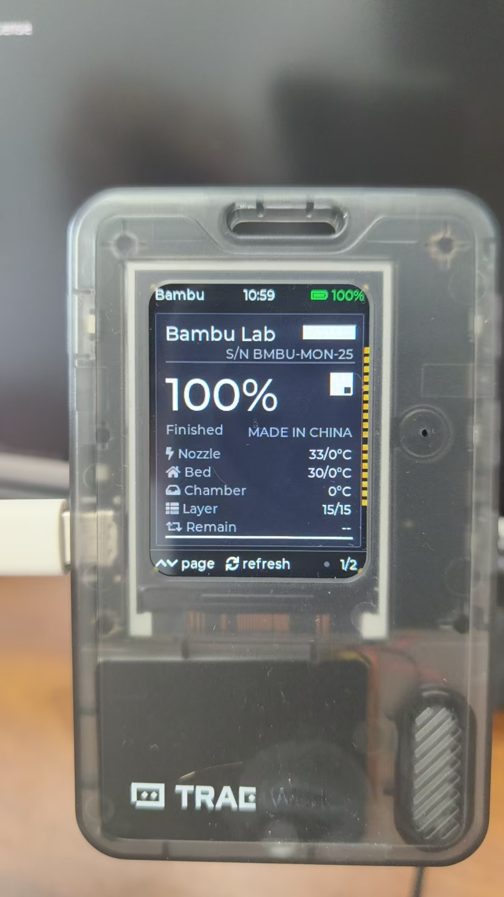
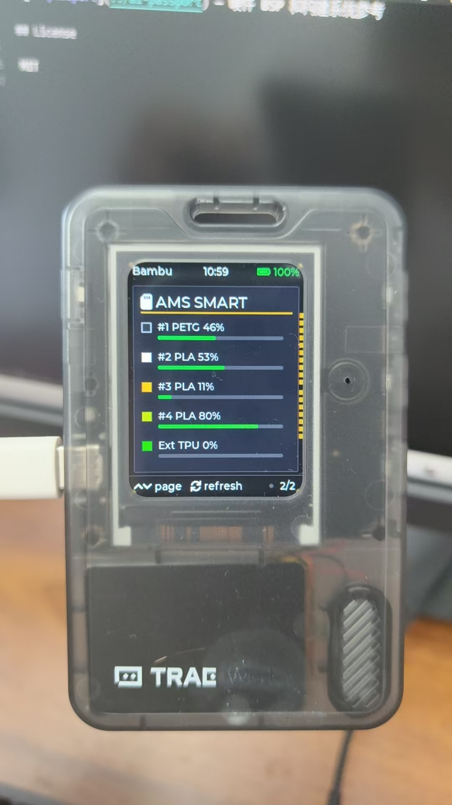
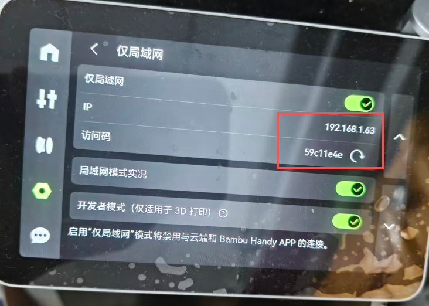

# ai-passport-bambu-monitor

基于 FoloToy AI Passport（ESP32-C3）的拓竹打印机局域网监控设备。

通过 MQTT-TLS 连接拓竹打印机，实时显示打印状态、温度、进度、AMS 等信息。

## 特性

- **10 种 UI 风格**：拓竹原厂 / 赛博 / 希卡石板 / 纯白 / 工控 / 霓虹 / 像素机器人 / 固态硬盘标签 / F1 转播计时 / 图形仪表盘
- **数据驱动配色**：耗材颜色、电量、状态色均由 MQTT 实时数据决定，不是写死的
- **3 按键交互**：UP/DOWN 翻页，OK 刷新
- **局域网直连**：无需云端，数据不出局域网
- **支持 X1/P1/A1 系列**：自动适配不同型号的数据格式

## 硬件要求

- FoloToy AI Passport（ESP32-C3 + 240×320 ST7789P + 3 按键）
- 拓竹打印机（X1-Carbon / X1 / P1P / P1S / A1 / A1 Mini 等）
- 同一局域网（2.4GHz WiFi）

## 实机效果

TRAG 透明壳实机运行（固态硬盘标签风 STYLE_SSD）：

第 1 页 —— 打印状态（黑标签白印 + 反白条码/二维码 + SATA 金手指）：



第 2 页 —— AMS 料仓（SMART 信息表样式，实时耗材类型/余量/颜色）：



## 快速开始

### 1. 打印机端设置（必须）

在拓竹打印机屏幕上进入 **设置 > 网络**，开启以下两项：

- **仅局域网模式**：开启后显示打印机 **IP** 和 **访问码**（8 位，每次重启打印机后会变化）
- **开发者模式**（仅适用于 3D 打印）



记下上图中红框内的 **IP**（如 `192.168.1.63`）和**访问码**；序列号在 设置 > 设备 > 序列号（15 位）。

> 注意：开启「仅局域网模式」将断开拓竹云服务和 Handy APP 的连接，设备改走纯局域网 MQTT-TLS 通信（端口 8883）。

### 2. 创建配置文件

```bash
# 从模板复制配置文件（config.h 已在 .gitignore 中，不会提交到仓库）
cp main/config.example.h main/config.h
```

编辑 `main/config.h`：

```c
// WiFi
#define CFG_WIFI_SSID       "你的WiFi名称"
#define CFG_WIFI_PASSWORD   "你的WiFi密码"

// 打印机
#define CFG_PRINTER_IP      "192.168.1.XXX"    // 打印机 IP
#define CFG_PRINTER_SERIAL  "YOUR_SERIAL"      // 序列号（15 位）
#define CFG_ACCESS_CODE     "YOUR_CODE"        // 访问码（8 位）

// UI 风格（STYLE_BAMBU / CYBER / SHEIKAH / WHITE / INDUSTRIAL / NEON / PIXEL / SSD / F1 / GAUGE）
#define CFG_UI_STYLE  STYLE_SSD
```

> **注意**：`config.h` 包含你的 WiFi 密码和打印机访问码，已在 `.gitignore` 中排除，请勿手动提交到仓库。

### 3. 编译烧录

```bash
# 设置 ESP-IDF 环境
. $IDF_PATH/export.sh

# 编译
idf.py build

# 烧录
idf.py -p /dev/ttyACM0 flash
```

## UI 风格说明

编译前在 `main/config.h` 中修改 `CFG_UI_STYLE` 选择，共 10 套：

| 宏定义 | 特点 |
|--------|------|
| `STYLE_BAMBU` | 拓竹原厂极简工业风 |
| `STYLE_CYBER` | 赛博极简监控风 |
| `STYLE_SHEIKAH` | 希卡石板风 |
| `STYLE_WHITE` | 纯白极简素雅风 |
| `STYLE_INDUSTRIAL` | 硬核机房工控风 |
| `STYLE_NEON` | 极简霓虹低饱和极客风 |
| `STYLE_PIXEL` | 像素机器人风（ai-passport 官网同款） |
| `STYLE_SSD` | 固态硬盘标签风（黑标签白印 + 金铜螺丝 + SATA 金手指） |
| `STYLE_F1` | F1 转播计时风（碳黑 + 涂装色条行卡 + F1 红 + 旗黄计时） |
| `STYLE_GAUGE` | 图形仪表盘风（六圆弧仪表环 + AMS 竖条电池，参考 BambuHelper） |

全部风格均为 2 页分页：第 1 页打印状态（进度/温度/层高/剩余时间），第 2 页 AMS 料仓。视觉规格详见 [UI 设计说明](docs/UI-DESIGN.md)。

## 按键操作

| 按键 | 短按 | 长按 |
|------|------|------|
| UP | 上一页 | — |
| DOWN | 下一页 | — |
| OK | 刷新数据（pushall） | 退出（预留） |

## 文档

- [开发文档](docs/README.md) — 技术架构、数据流、构建步骤
- [开发日志](docs/development-log.md) — 完整开发过程与踩坑记录

## 项目结构

```
ai-passport-bambu-monitor/
├── components/bsp/          # 硬件抽象层（显示 + 按键 + LVGL）
│   ├── include/
│   │   ├── bsp_pins.h       # 引脚定义
│   │   ├── bsp_display.h    # 显示接口
│   │   └── bsp_button.h     # 按键接口
│   └── src/
├── main/
│   ├── config.example.h   # ★ 配置模板（复制为 config.h 后修改）
│   ├── config.h           # 个人配置（.gitignore 排除，勿提交）
│   ├── main.c               # 入口
│   ├── bambu_state.h/c      # 打印机状态数据结构
│   ├── bambu_mqtt.h/c       # MQTT-TLS 客户端
│   └── ui/
│       ├── ui_theme.h/c     # 主题色板 + 电池分档色 + 耗材色块
│       ├── ui_lang.h        # 多语言文案宏
│       ├── ui_monitor.h/c   # 风格派发 + 分页
│       └── style_*.c        # 10 套风格实现（bambu/cyber/sheikah/white/industrial/neon/pixel/ssd/f1/gauge）
├── docs/
│   ├── README.md            # 开发文档（架构/数据流/构建）
│   └── development-log.md   # 开发日志（踩坑记录）
├── CMakeLists.txt
├── sdkconfig.defaults
├── partitions.csv
└── .gitignore
```

## 内存优化

ESP32-C3 无 PSRAM，已做以下优化：

- MQTT 缓冲区：16KB（可配置）
- LVGL DMA 缓冲：20 行单缓冲（~9.6KB）
- JSON 解析：cJSON 流式解析
- TLS：跳过证书验证（拓竹自签名证书）

## 参考项目与文章

- [BambuHelper](https://github.com/Keralots/BambuHelper) — 功能丰富的拓竹监控固件
- [AtomS3R-BambuMonitor](https://github.com/Mevius1073/AtomS3R-BambuMonitor) — 轻量级 MQTT 协议参考
- [ai-passport](https://github.com/FoloToy/ai-passport) — 硬件 BSP 和构建系统参考
- [自制拓竹 AMS 笔记](https://yaoec.top/index.php/archives/190/) — MQTT 连接拓竹打印机的连接参数（bblp / 8883 / report 主题）与示例代码

## License

MIT
