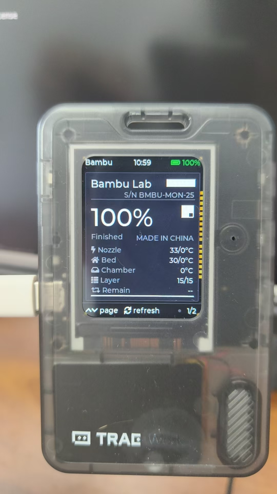
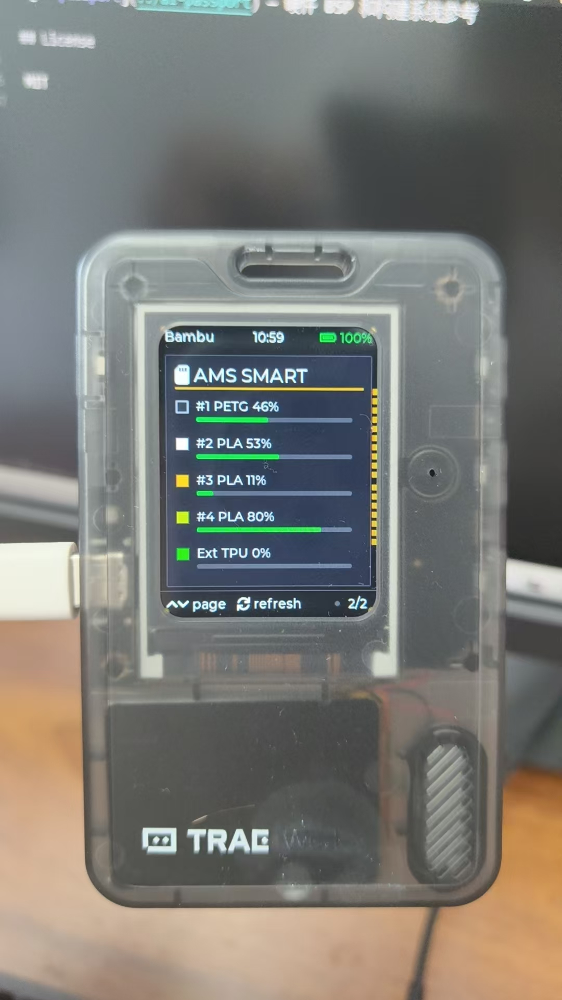
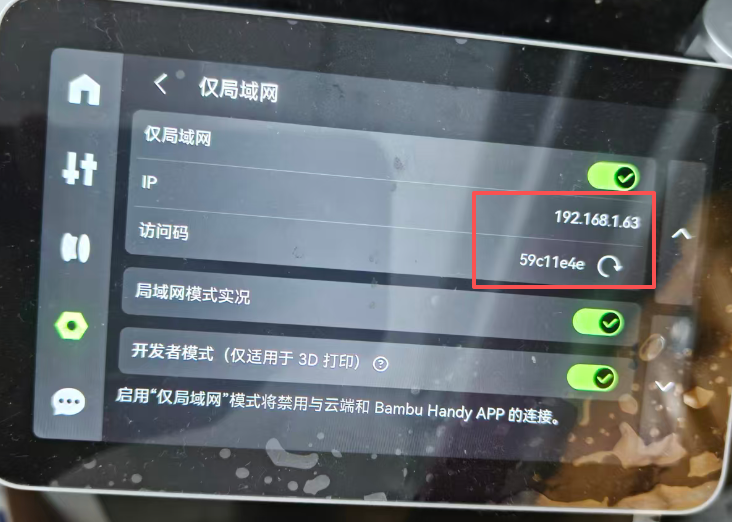

# ai-passport-bambu-monitor · 拓竹打印机监控器



基于 [FoloToy AI Passport](https://github.com/FoloToy/ai-passport) 的拓竹打印机监控设备：局域网直连拓竹打印机，实时显示打印进度、喷嘴/热床温度、层数、剩余时间和 AMS 料仓余量，不用守在打印机前。

| 设备界面 · 第 1 页 | 设备界面 · 第 2 页 |
|:---:|:---:|
|  |  |

> **✅ 支持预编译固件**：固件不含任何网络凭据，但**首次开机会自动进入配网模式**——手机连接设备热点，在网页中填入 WiFi 与打印机信息即可完成配置，**无需编译环境、无需改代码**。详见 [手机配网](#2-手机配网推荐)。开发者也可选择在 `main/config.h` 中预置配置后从源码编译（见 [编译期配置](#3-编译期配置可选)）。

## 功能一览

| 按键 | 操作 | 效果 |
|------|------|------|
| 上键 | 短按 | 上一页 |
| 下键 | 短按 | 下一页 |
| 确认键 | 短按 | 刷新数据（向打印机请求全量状态） |
| 确认键 | 长按 | 进入配网模式（未连接打印机时可用，重新配置 WiFi/打印机） |

屏幕实时显示：时间、电池电量、打印状态（打印中/已暂停/已完成/失败）、进度、喷嘴/热床/腔体温度、层数、剩余时间、速度、AMS 料仓类型与余量。

- **12 种 UI 风格**：拓竹原厂 / 赛博 / 希卡石板 / 纯白 / 工控 / 霓虹 / 像素机器人 / 固态硬盘标签 / F1 转播计时 / 图形仪表盘 / Geist 控制台 / Apple，编译前一行宏切换
- **手机配网**：无需编译环境，开机进配网模式，手机连热点填表单即可
- **数据驱动配色**：耗材颜色、电量、状态色均来自打印机实时数据，不是写死的
- **局域网直连**：无需云端，数据不出局域网
- **支持 X1/P1/A1 系列**：自动适配不同型号的数据格式

## UI 风格

编译前在 `main/config.h` 中修改 `CFG_UI_STYLE` 选择，共 12 套：

| 宏定义 | 特点 |
|--------|------|
| `STYLE_BAMBU` | 拓竹原厂极简工业风 |
| `STYLE_CYBER` | 赛博极简监控风 |
| `STYLE_SHEIKAH` | 希卡石板风 |
| `STYLE_WHITE` | 纯白极简素雅风 |
| `STYLE_INDUSTRIAL` | 硬核机房工控风 |
| `STYLE_NEON` | 极简霓虹低饱和极客风 |
| `STYLE_PIXEL` | 像素机器人风（ai-passport 官网同款） |
| `STYLE_SSD` | 固态硬盘标签风（黑标签白印 + 金铜螺丝 + SATA 金手指） |
| `STYLE_F1` | F1 转播计时风（碳黑 + 涂装色条行卡 + F1 红 + 旗黄计时） |
| `STYLE_GAUGE` | 图形仪表盘风（六圆弧仪表环 + AMS 竖条电池，参考 BambuHelper） |
| `STYLE_GEIST` | Geist 控制台风（纯黑 + Vercel 蓝 + 发丝线分区，参考 Vercel Geist） |
| `STYLE_APPLE` | Apple 风（iOS 浅灰分组底 + 白色圆角卡片 + systemBlue，参考 iOS HIG） |

全部风格均为 2 页分页：第 1 页打印状态（进度/温度/层高/剩余时间），第 2 页 AMS 料仓。视觉规格详见 [UI 设计说明](docs/UI-DESIGN.md)。

## 使用方法

### 1. 打印机端设置（必须）

在拓竹打印机屏幕上进入 **设置 > 网络**，开启以下两项：

- **仅局域网模式**：开启后显示打印机 **IP** 和**访问码**（8 位，每次重启打印机后会变化）
- **开发者模式**（仅适用于 3D 打印）



记下上图中红框内的 **IP**（如 `192.168.1.63`）和**访问码**；序列号在 设置 > 设备 > 序列号（15 位）。

> 注意：开启「仅局域网模式」将断开拓竹云服务和 Handy APP 的连接，设备改走纯局域网加密通信（端口 8883）。

### 2. 手机配网（推荐）

烧录固件（预编译或自行编译均可）后，设备首次开机或长按确认键会进入**配网模式**：

1. 设备屏幕显示热点名（形如 `Passport-XXXX`）；用手机 WiFi 连接该热点（无密码，连上后多数手机会自动弹出配置页）
2. 若未自动弹出，手动在浏览器打开 `http://192.168.4.1`
3. 在网页中填写 WiFi（2.4GHz）、打印机 IP、序列号、访问码，点「保存并重启设备」
4. 设备自动重启并连接 WiFi 与打印机，屏幕显示实时数据即成功

> 配置保存在设备本地存储（NVS），不上传任何服务器。想换 WiFi 或换打印机：长按确认键重新进入配网模式即可。

### 3. 编译期配置（可选）

开发者也可以在编译时预置默认配置（设备仍可长按确认键进配网模式修改）：

```bash
# 从模板复制配置文件（config.h 已在 .gitignore 中，不会提交到仓库）
cp main/config.example.h main/config.h
```

编辑 `main/config.h`：

```c
// WiFi（2.4GHz）
#define CFG_WIFI_SSID       "你的WiFi名称"
#define CFG_WIFI_PASSWORD   "你的WiFi密码"

// 打印机
#define CFG_PRINTER_IP      "192.168.1.XXX"    // 打印机 IP
#define CFG_PRINTER_SERIAL  "YOUR_SERIAL"      // 序列号（15 位）
#define CFG_ACCESS_CODE     "YOUR_CODE"        // 访问码（8 位）

// UI 风格（STYLE_BAMBU / CYBER / SHEIKAH / WHITE / INDUSTRIAL / NEON / PIXEL / SSD / F1 / GAUGE / GEIST / APPLE）
#define CFG_UI_STYLE  STYLE_SSD
```

> **注意**：`config.h` 包含你的 WiFi 密码和打印机访问码，已在 `.gitignore` 中排除，请勿手动提交到仓库。

### 4. 编译烧录

见 [构建与烧录](#构建与烧录)。烧录成功后设备自动连接 WiFi 与打印机，屏幕显示打印数据。

**成功标志**：状态行显示打印机实时数据；若开机约 15 秒后屏幕显示"无法连接网络"指引卡，长按确认键进入配网模式重新填写，或检查编译期配置后重新烧录（指引卡在连接成功后会自动消失）。

## 构建与烧录

需要 [ESP-IDF](https://docs.espressif.com/projects/esp-idf/zh_CN/latest/esp32c3/) 5.5.3 环境（ESP32-C3 目标板）。

### 从源码构建（推荐）

```bash
# 可选: 先完成「使用方法」第 3 步, 预置编译期默认配置 (也可烧录后手机配网)
idf.py build
idf.py merge-bin
copy build\merged-binary.bin build\ai-passport-bambu-monitor-full.bin
idf.py -p COM3 flash
```

烧录完成后设备自动联网并显示监控界面。

### 烧录预编译固件

从 [Releases](../../releases) 下载 `ai-passport-bambu-monitor-full.bin`，使用 `esptool.py` 烧录：

```bash
esptool.py --chip esp32c3 -p COM3 --baud 460800 write_flash 0x0 ai-passport-bambu-monitor-full.bin
```

> 将 `COM3` 替换为设备实际串口号。Windows 可在设备管理器中查看。
>
> **预编译固件不含网络配置**：首次开机会自动进入配网模式，按 [手机配网](#2-手机配网推荐) 填写即可正常使用，无需编译。

## 项目结构

```
ai-passport-bambu-monitor/
├── components/bsp/          # 硬件抽象层（显示 + 按键 + LVGL）
│   ├── include/
│   │   ├── bsp_pins.h       # 引脚定义
│   │   ├── bsp_display.h    # 显示接口
│   │   └── bsp_button.h     # 按键接口
│   └── src/
├── main/
│   ├── config.example.h     # ★ 配置模板（复制为 config.h 后修改）
│   ├── config.h             # 个人配置（.gitignore 排除，勿提交）
│   ├── main.c               # 入口（启动状态机 + 配网模式触发）
│   ├── app_config.h/c       # 运行时配置（NVS 持久化 + 编译期默认值）
│   ├── wifi_prov.h/c        # 配网模式（SoftAP + captive DNS + 网页表单）
│   ├── bambu_state.h/c      # 打印机状态数据结构
│   ├── bambu_mqtt.h/c       # MQTT-TLS 客户端
│   └── ui/
│       ├── ui_theme.h/c     # 主题色板 + 电池分档色 + 耗材色块
│       ├── ui_lang.h        # 多语言文案宏
│       ├── ui_monitor.h/c   # 风格派发 + 分页
│       └── style_*.c        # 12 套风格实现（bambu/cyber/sheikah/white/industrial/neon/pixel/ssd/f1/gauge/geist/apple）
├── docs/
│   ├── README.md            # 开发文档（架构/数据流/构建）
│   └── development-log.md   # 开发日志（踩坑记录）
├── CMakeLists.txt
├── sdkconfig.defaults
├── partitions.csv
└── .gitignore
```

## 文档

- [开发文档](docs/README.md) — 技术架构、数据流、构建步骤
- [开发日志](docs/development-log.md) — 完整开发过程与踩坑记录
- [UI 设计说明](docs/UI-DESIGN.md) — 12 套风格的视觉规格

## 参考项目与文章

- [BambuHelper](https://github.com/Keralots/BambuHelper) — 功能丰富的拓竹监控固件
- [AtomS3R-BambuMonitor](https://github.com/Mevius1073/AtomS3R-BambuMonitor) — 轻量级 MQTT 协议参考
- [ai-passport](https://github.com/FoloToy/ai-passport) — 硬件 BSP 和构建系统参考
- [自制拓竹 AMS 笔记](https://yaoec.top/index.php/archives/190/) — MQTT 连接拓竹打印机的连接参数（bblp / 8883 / report 主题）与示例代码

## License

MIT

---

# ai-passport-bambu-monitor (English)


A Bambu Lab printer monitor built on [FoloToy AI Passport](https://github.com/FoloToy/ai-passport): connects to your printer over LAN and shows print progress, nozzle/bed temperatures, layer, remaining time and AMS filament levels in real time — no need to babysit the printer.

| Device UI · Page 1 | Device UI · Page 2 |
|:---:|:---:|
|  |  |

> **✅ Prebuilt firmware supported**: the firmware ships with no network credentials, but **first boot enters setup mode** — connect your phone to the device hotspot and fill in WiFi and printer info on a web page, **no build environment or code changes needed**. See [Phone provisioning](#2-phone-provisioning-recommended). Developers can instead bake defaults into `main/config.h` before building (see [Build-time configuration](#3-build-time-configuration-optional)).

## Controls

| Button | Action | Effect |
|--------|--------|--------|
| Up | Click | Previous page |
| Down | Click | Next page |
| OK | Click | Refresh data (request full state from the printer) |
| OK | Long-press | Enter setup mode (when the printer is not connected; reconfigure WiFi/printer) |

The screen shows time, battery, print state (running/paused/finished/failed), progress, nozzle/bed/chamber temperatures, layer, remaining time, speed and AMS slots.

- **12 UI styles**: switch with a single macro before compiling
- **Phone provisioning**: no build environment needed — boot into setup mode, join the hotspot and fill in the form
- **Data-driven colors**: filament colors, battery and state colors all come from live printer data
- **LAN only**: no cloud involved, data never leaves your network
- **X1/P1/A1 series supported**: adapts to different models automatically

## Usage

### 1. Printer setup (required)

On the printer screen go to **Settings > Network** and enable:

- **LAN Only Mode**: the screen then shows the printer **IP** and **access code** (8 digits, changes on every printer reboot)
- **Developer Mode**

Note down the **IP** (e.g. `192.168.1.63`) and **access code**; the serial number is under Settings > Device > Serial Number (15 chars).

> LAN Only Mode disconnects Bambu cloud services and the Handy app; the device talks to the printer over encrypted LAN communication (port 8883).

### 2. Phone provisioning (recommended)

After flashing the firmware (prebuilt or self-built), the device enters **setup mode** on first boot or when you long-press OK:

1. The screen shows the hotspot name (e.g. `Passport-XXXX`); connect your phone's WiFi to it (open network — most phones pop up the config page automatically)
2. If nothing pops up, open `http://192.168.4.1` in a browser
3. Fill in your WiFi (2.4GHz), printer IP, serial number and access code, then tap save — the device reboots
4. The device reconnects automatically; live data on screen means success

> Configuration is stored locally on the device (NVS), never uploaded. To change WiFi or printer later: long-press OK to re-enter setup mode.

### 3. Build-time configuration (optional)

Developers can bake default config at compile time (the device can still be re-provisioned by long-pressing OK):

```bash
cp main/config.example.h main/config.h
```

Edit `main/config.h`:

```c
// WiFi (2.4GHz)
#define CFG_WIFI_SSID       "your-wifi"
#define CFG_WIFI_PASSWORD   "your-password"

// Printer
#define CFG_PRINTER_IP      "192.168.1.XXX"
#define CFG_PRINTER_SERIAL  "YOUR_SERIAL"      // 15 chars
#define CFG_ACCESS_CODE     "YOUR_CODE"        // 8 digits

// UI style
#define CFG_UI_STYLE  STYLE_SSD
```

> `config.h` contains your WiFi password and printer access code; it is excluded by `.gitignore` — never commit it.

### 4. Build and flash

See [Build & Flash](#build--flash). After flashing, the device connects to WiFi and the printer automatically and shows live print data.

**Success check**: the state row shows live printer data. If a "Network not connected" card appears ~15 seconds after boot, long-press OK to re-enter setup mode, or fix the build-time config and reflash (the card disappears automatically once connected).

## Build & Flash

Requires [ESP-IDF](https://docs.espressif.com/projects/esp-idf/en/latest/esp32c3/) 5.5.3 (ESP32-C3 target).

### Build from source (recommended)

```bash
# Optional: complete "Usage" step 3 first to bake build-time defaults (or provision by phone after flashing)
idf.py build
idf.py merge-bin
copy build\merged-binary.bin build\ai-passport-bambu-monitor-full.bin
idf.py -p COM3 flash
```

### Flash prebuilt firmware

Download `ai-passport-bambu-monitor-full.bin` from [Releases](../../releases) and flash with `esptool.py`:

```bash
esptool.py --chip esp32c3 -p COM3 --baud 460800 write_flash 0x0 ai-passport-bambu-monitor-full.bin
```

> Replace `COM3` with your actual serial port. On Windows, check Device Manager.
>
> **The prebuilt firmware contains no network configuration**: first boot enters setup mode — follow [Phone provisioning](#2-phone-provisioning-recommended) and it works with no building required.

## License

MIT
