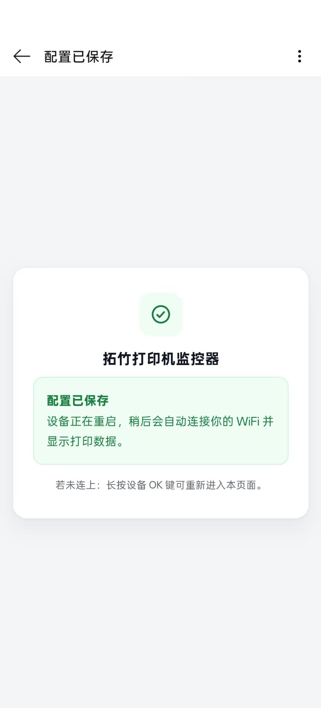

# ai-passport-bambu-monitor · 拓竹打印机监控器

<p align="center">
  &nbsp;&nbsp;&nbsp;&nbsp;
</p>

<p align="center">社区封面 · 设备界面实拍（SSD 风格，第 1 / 2 页）</p>

基于 [FoloToy AI Passport](https://github.com/FoloToy/ai-passport) 的拓竹打印机监控器：局域网直连打印机，打印进度、喷嘴 / 热床温度、层数、剩余时间和 AMS 料仓余量实时上屏——挂在包上或放在桌上，不用守在打印机前。

> **✅ 开箱即用**：预编译固件不含任何网络凭据，首次开机自动进入配网模式，手机连热点、填个网页表单就能用，**无需编译环境、无需改代码**。

## 能玩什么

- **实时状态一眼掌握**：进度 / 状态、喷嘴 / 热床 / 腔体三路温度、层数、剩余时间、速度、AMS 四料仓 + 外部耗材余量与材质，电池分档变色
- **12 种 UI 风格**：拓竹原厂 / 赛博 / 希卡石板 / 纯白 / 工控 / 霓虹 / 像素机器人 / 固态硬盘标签 / F1 转播计时 / 图形仪表盘 / Geist 控制台 / Apple，配网页下拉即换、无需重编译；中 / 英双语界面
- **布局自定义**：第 1 页显示哪些数据、什么顺序，配网页勾选 + 上下移动即可（7 套风格支持）
- **数据驱动配色**：耗材色块、状态色、电量色全部跟随打印机实时数据，不是写死的
- **纯局域网**：不走云端、数据不出家门；支持 X1 / P1 / A1 系列，自动适配数据格式

**按键**：上 / 下键翻页 · 确认键短按刷新数据 · 确认键长按进入配网模式

## 快速上手（约 3 分钟）

### 1. 打印机开局域网模式（一次性）

打印机屏幕进入 **设置 > 网络**，开启 **仅局域网模式** 与 **开发者模式**，记下屏幕显示的 **IP** 和 **8 位访问码**（打印机每次重启后访问码会变）；**序列号**（15 位）在 设置 > 设备。

<p align="center"></p>

> 开启「仅局域网模式」会断开拓竹云与 Handy APP；设备改走局域网加密通道（端口 8883）与打印机通信。

### 2. 手机连热点填表

1. 首次开机（或长按确认键），设备进入配网模式，屏幕显示热点名与地址
2. 手机连接 `Passport-XXXX` 热点（无密码），配置页通常自动弹出；没弹出就在浏览器打开 `http://192.168.4.1`
3. 填写 WiFi（仅支持 2.4GHz）、打印机 IP、序列号、访问码，顺手选好风格 / 语言 / 组件排序，点「保存并重启设备」

<table>
  <tr>
    <td align="center" width="50%"><br/>① 设备进入配网模式，屏幕给出热点名与地址</td>
    <td align="center" width="50%"><br/>② 保存重启后自动连上，实时数据上屏（示例：Gauge 风格）</td>
  </tr>
</table>

手机配网页三步：

<table>
  <tr>
    <td align="center" width="33%"><br/>填写 WiFi 与打印机信息</td>
    <td align="center" width="33%"><br/>勾选并上下移动调整组件排序</td>
    <td align="center" width="33%"><br/>保存成功，设备自动重启</td>
  </tr>
</table>

### 3. 完成

设备重启后自动联网，屏幕出现实时打印数据即可开玩；若显示「无法连接网络」指引卡，长按确认键重新填写即可。配置保存在设备本地（NVS），不上传任何服务器；以后换 WiFi 或换打印机，长按确认键重新配网就行。

---

## 开发者专区（可选）

以下内容只面向想自行编译或改默认值的开发者——**普通用户跳过不影响使用**，烧录后的设备随时可长按确认键进配网页修改全部设置。

### 编译期默认配置

```bash
cp main/config.example.h main/config.h   # config.h 已被 .gitignore 排除，勿提交
```

```c
// WiFi（2.4GHz）
#define CFG_WIFI_SSID       "你的WiFi名称"
#define CFG_WIFI_PASSWORD   "你的WiFi密码"

// 打印机
#define CFG_PRINTER_IP      "192.168.1.XXX"    // 打印机 IP
#define CFG_PRINTER_SERIAL  "YOUR_SERIAL"      // 序列号（15 位）
#define CFG_ACCESS_CODE     "YOUR_CODE"        // 访问码（8 位）

// 出厂默认风格与语言：仅在设备 NVS 无记录时生效，之后随时可在配网页修改
#define CFG_UI_STYLE  STYLE_SSD    // STYLE_BAMBU / CYBER / SHEIKAH / WHITE / INDUSTRIAL /
                                   // NEON / PIXEL / SSD / F1 / GAUGE / GEIST / APPLE
#define CFG_LANG      LANG_CN      // LANG_EN / LANG_CN

// 组件排序出厂默认（可选）：1喷嘴 2热床 3腔体 4层数 5进度 6剩余 7状态 8速度 9AMS
// #define CFG_COMPONENT_ORDER  {5, 4, 1, 2, 7, 8}
```

### 构建与烧录

需要 [ESP-IDF](https://docs.espressif.com/projects/esp-idf/zh_CN/latest/esp32c3/) 5.5.3（ESP32-C3 目标）：

```bash
idf.py build
idf.py merge-bin
copy build\merged-binary.bin build\ai-passport-bambu-monitor-full.bin
idf.py -p COM3 flash
```

或直接烧录 [Releases](../../releases) 的预编译固件（首次开机进配网模式，无需任何编译）：

```bash
esptool.py --chip esp32c3 -p COM3 --baud 460800 write_flash 0x0 ai-passport-bambu-monitor-full.bin
```

### 风格实现与项目结构

12 套风格位于 `main/ui/style_*.c`，视觉规格见 [UI 设计说明](docs/UI-DESIGN.md)。

```
ai-passport-bambu-monitor/
├── components/bsp/       # 硬件抽象层（显示 + 按键 + LVGL）
├── main/
│   ├── config.example.h  # 配置模板（复制为 config.h 后修改）
│   ├── main.c            # 入口（启动状态机 + 配网模式触发）
│   ├── app_config.h/c    # 运行时配置（NVS 持久化 + 编译期默认值）
│   ├── wifi_prov.h/c     # 配网模式（SoftAP + captive DNS + 网页表单）
│   ├── bambu_state.h/c   # 打印机状态数据结构
│   ├── bambu_mqtt.h/c    # MQTT-TLS 客户端
│   └── ui/               # 主题 / 多语言 / 风格派发 + 12 套 style_*.c
└── docs/                 # 开发文档与开发日志
```

## 文档

- [开发文档](docs/README.md) — 技术架构、数据流、构建步骤
- [开发日志](docs/development-log.md) — 完整开发过程与踩坑记录
- [UI 设计说明](docs/UI-DESIGN.md) — 12 套风格的视觉规格

## 参考项目与文章

- [BambuHelper](https://github.com/Keralots/BambuHelper) — 功能丰富的拓竹监控固件
- [AtomS3R-BambuMonitor](https://github.com/Mevius1073/AtomS3R-BambuMonitor) — 轻量级 MQTT 协议参考
- [ai-passport](https://github.com/FoloToy/ai-passport) — 硬件 BSP 和构建系统参考
- [自制拓竹 AMS 笔记](https://yaoec.top/index.php/archives/190/) — MQTT 连接拓竹打印机的连接参数（bblp / 8883 / report 主题）与示例代码

## License

MIT

---

# ai-passport-bambu-monitor (English)

<p align="center">
  &nbsp;&nbsp;&nbsp;&nbsp;
</p>

<p align="center">Community cover · device UI photos (SSD style, page 1 / 2)</p>

A Bambu Lab printer monitor built on [FoloToy AI Passport](https://github.com/FoloToy/ai-passport): connects to your printer over LAN and shows print progress, nozzle/bed temperatures, layer, remaining time and AMS filament levels in real time — glance at your desk instead of babysitting the printer.

> **✅ Works out of the box**: the prebuilt firmware ships with no network credentials. First boot enters setup mode — join the hotspot with your phone and fill in a web form. No build environment, no code changes.

## What you get

- **Live status at a glance**: progress / state, nozzle / bed / chamber temperatures, layer, remaining time, speed, 4 AMS slots + external spool with material types, battery tint changes with charge
- **12 UI styles**: Bambu-original, cyber, sheikah, pure white, industrial, neon, pixel robot, SSD label, F1 timing, gauge, Geist console, Apple — switch from a dropdown on the setup page, no recompile; Chinese / English interface
- **Custom layout**: pick which tiles appear on page 1 and reorder them on the setup page (supported by 7 styles)
- **Data-driven colors**: filament swatches, state and battery colors all follow live printer data
- **LAN only**: no cloud, data never leaves your network; supports X1 / P1 / A1 series automatically

**Buttons**: Up / Down switch pages · OK click refreshes data · OK long-press enters setup mode

## Quick start (about 3 minutes)

### 1. Enable LAN mode on the printer (one-time)

On the printer screen go to **Settings > Network**, enable **LAN Only Mode** and **Developer Mode**, note the on-screen **IP** and 8-digit **access code** (changes on every printer reboot); the 15-character **serial number** is under Settings > Device.

<p align="center"></p>

> LAN Only Mode disconnects Bambu cloud services and the Handy app; the device talks to the printer over an encrypted LAN channel (port 8883).

### 2. Provision from your phone

1. On first boot (or after long-pressing OK) the device enters setup mode and shows its hotspot name and address
2. Join the `Passport-XXXX` hotspot (open network) — the config page usually pops up; if not, open `http://192.168.4.1` in a browser
3. Fill in Wi-Fi (2.4 GHz only), printer IP, serial number and access code, optionally pick style / language / tile order, then tap "Save & Restart"

<table>
  <tr>
    <td align="center" width="50%"><br/>① Device enters setup mode with hotspot name &amp; address</td>
    <td align="center" width="50%"><br/>② After saving it reboots and connects — live data on screen (Gauge style shown)</td>
  </tr>
</table>

The config page in three steps:

<table>
  <tr>
    <td align="center" width="33%"><br/>Fill in Wi-Fi &amp; printer info</td>
    <td align="center" width="33%"><br/>Tick and reorder data tiles</td>
    <td align="center" width="33%"><br/>Saved — device reboots</td>
  </tr>
</table>

### 3. Done

The device reboots, connects automatically, and live print data means you're set. If a "network not connected" card appears, long-press OK and re-enter the details. Everything is stored locally on the device (NVS), never uploaded; to change Wi-Fi or printer later, long-press OK to re-provision.

---

## For developers (optional)

Only for building from source or baking defaults — regular users can skip this; every setting stays changeable from the setup page (long-press OK).

### Build-time defaults

```bash
cp main/config.example.h main/config.h   # config.h is git-ignored — never commit it
```

```c
#define CFG_WIFI_SSID       "your-wifi"
#define CFG_WIFI_PASSWORD   "your-password"
#define CFG_PRINTER_IP      "192.168.1.XXX"
#define CFG_PRINTER_SERIAL  "YOUR_SERIAL"      // 15 chars
#define CFG_ACCESS_CODE     "YOUR_CODE"        // 8 digits
#define CFG_UI_STYLE  STYLE_SSD    // factory default only; change anytime on the setup page
#define CFG_LANG      LANG_EN      // LANG_EN / LANG_CN
// #define CFG_COMPONENT_ORDER  {5, 4, 1, 2, 7, 8}  // 1 nozzle 2 bed 3 chamber 4 layer
                                                   // 5 progress 6 remain 7 state 8 speed 9 AMS
```

### Build & flash

Requires [ESP-IDF](https://docs.espressif.com/projects/esp-idf/en/latest/esp32c3/) 5.5.3 (ESP32-C3 target):

```bash
idf.py build
idf.py merge-bin
copy build\merged-binary.bin build\ai-passport-bambu-monitor-full.bin
idf.py -p COM3 flash
```

Or flash the prebuilt image from [Releases](../../releases) — first boot enters setup mode, no building required:

```bash
esptool.py --chip esp32c3 -p COM3 --baud 460800 write_flash 0x0 ai-passport-bambu-monitor-full.bin
```

### Layout & docs

The 12 styles live in `main/ui/style_*.c`; visual specs in [UI-DESIGN.md](docs/UI-DESIGN.md). Core modules: `main/wifi_prov.c` (SoftAP + captive DNS + web form), `main/app_config.c` (NVS runtime config), `main/bambu_mqtt.c` (MQTT-TLS client), `components/bsp/` (display / buttons / LVGL).

## Docs

- [Development guide](docs/README.md) — architecture, data flow, build steps
- [Development log](docs/development-log.md) — full journey and pitfalls
- [UI design spec](docs/UI-DESIGN.md) — visual specs of the 12 styles

## Credits

- [BambuHelper](https://github.com/Keralots/BambuHelper) — feature-rich Bambu monitor firmware
- [AtomS3R-BambuMonitor](https://github.com/Mevius1073/AtomS3R-BambuMonitor) — lightweight MQTT protocol reference
- [ai-passport](https://github.com/FoloToy/ai-passport) — hardware BSP and build system reference
- [Homemade Bambu AMS notes](https://yaoec.top/index.php/archives/190/) — MQTT connection params (bblp / 8883 / report topic) and sample code

## License

MIT
