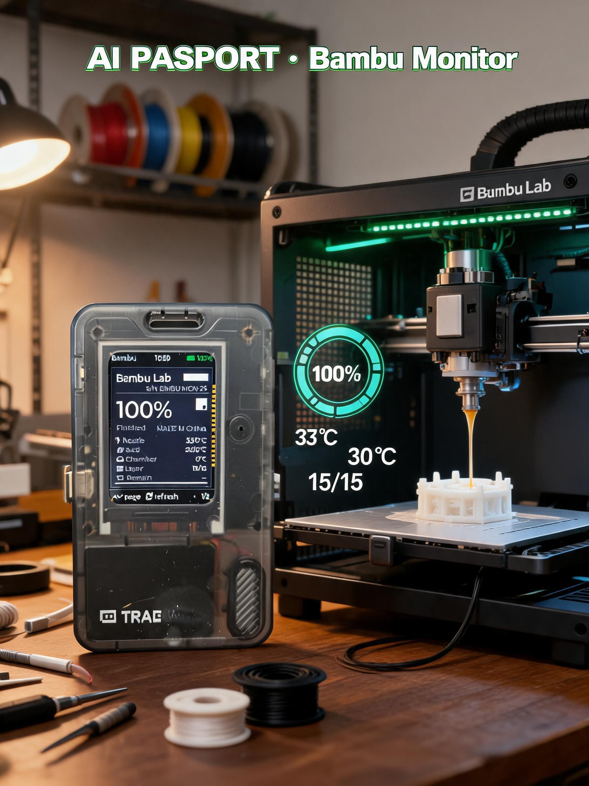
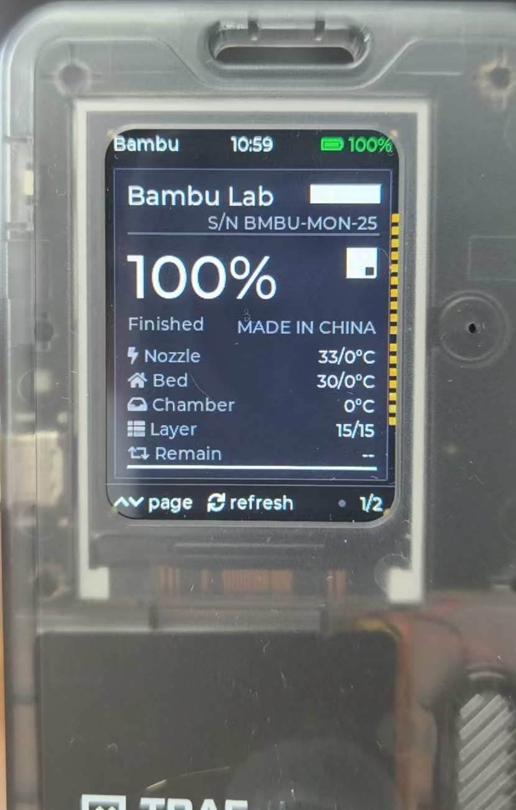
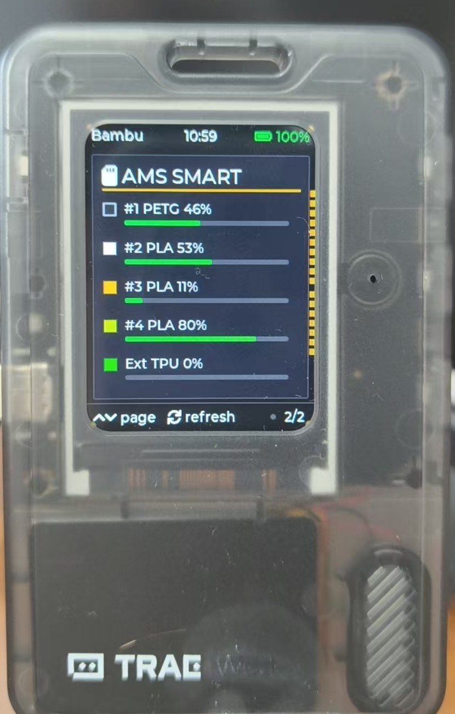
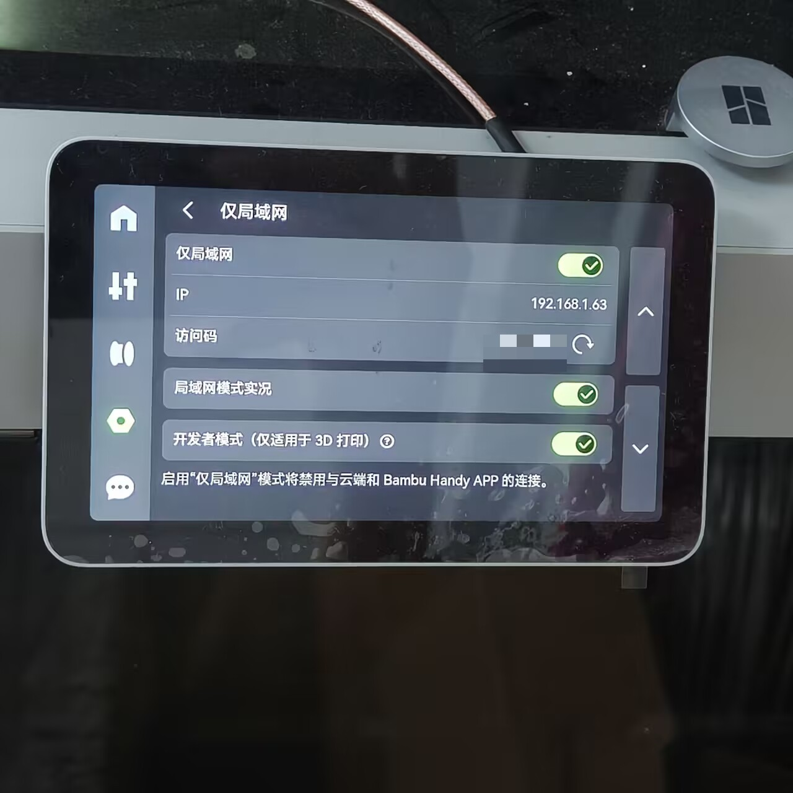
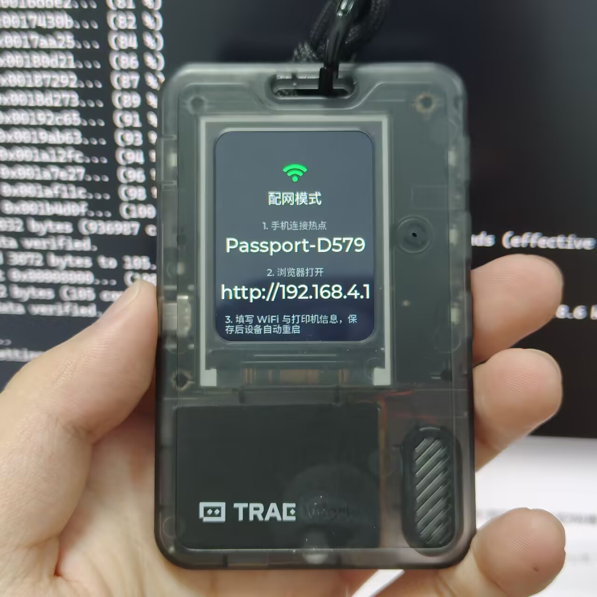
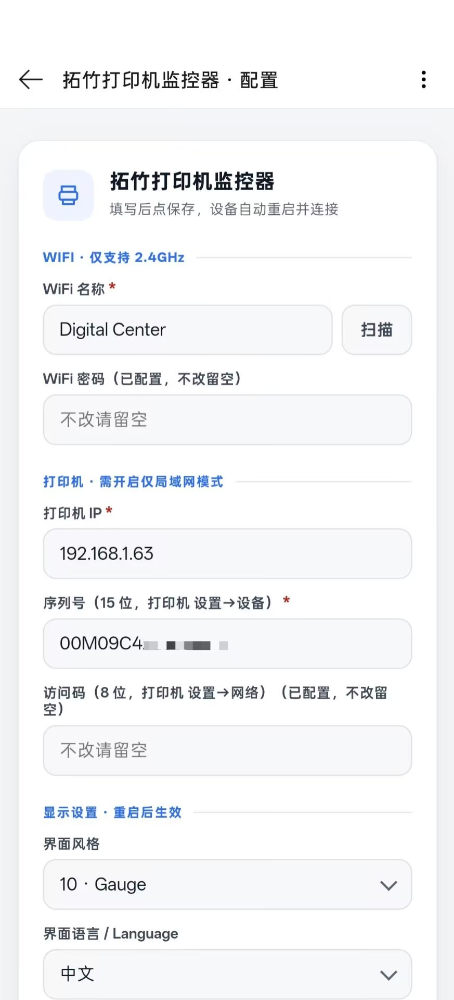
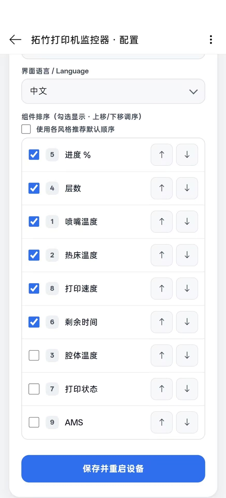
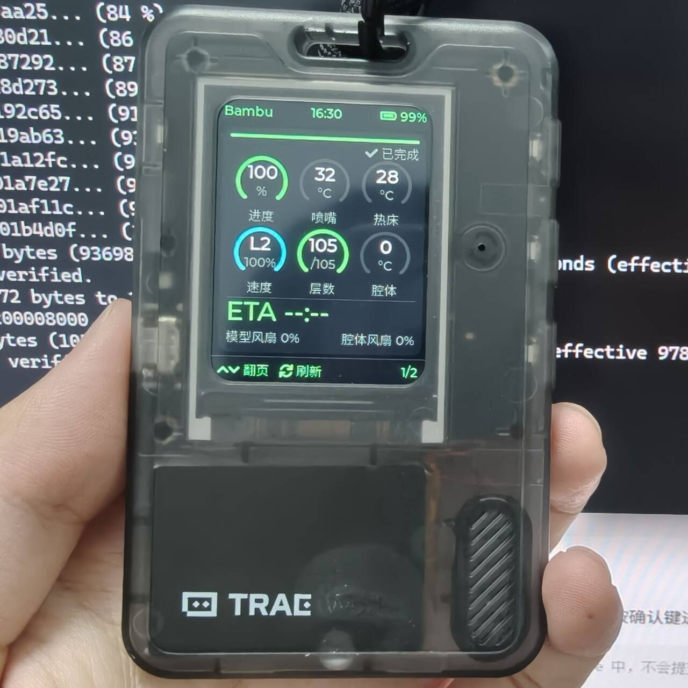

# 拓竹打印机监控器 · ai-passport-bambu-monitor

<table>
  <tr>
    <td align="center" width="34%"></td>
    <td align="center" width="33%"></td>
    <td align="center" width="33%"></td>
  </tr>
  <tr>
    <td align="center">社区封面</td>
    <td align="center">第 1 页 · 打印状态</td>
    <td align="center">第 2 页 · AMS 料仓</td>
  </tr>
</table>

基于 [FoloToy AI Passport](https://github.com/FoloToy/ai-passport) 的拓竹打印机监控器：局域网直连打印机，打印进度、温度、层数、剩余时间与 AMS 料仓余量实时上屏——挂在包上或放在桌上，不用守在打印机前。

> **✅ 开箱即用**：预编译固件不含任何凭据，首次开机自动进入配网模式，手机连热点填个网页表单就能用——无需编译环境、无需改代码。

## 能玩什么

- **实时状态**：进度 / 状态、三路温度、层数、剩余时间、速度、AMS 四料仓 + 外部耗材——色块跟随打印机数据变化，电池分档变色
- **12 种 UI 风格 + 中英双语**：配网页下拉即换、无需重编译；第 1 页显示哪些组件、什么顺序，也能勾选调序
- **纯局域网**：不走云端、数据不出家门；支持 X1 / P1 / A1 系列，自动适配数据格式

**按键**：上 / 下翻页 · 短按确认刷新数据 · 长按确认重新配网

## 快速上手（约 3 分钟）

**1. 打印机开启局域网模式（一次性）**：打印机屏上进入 **设置 > 网络**，开启 **仅局域网模式** 与 **开发者模式**，记下 **IP** 与 **8 位访问码**（打印机每次重启后访问码会变）；**15 位序列号**在 设置 > 设备。

<p align="center"></p>

**2. 手机配网**：首次开机（或长按确认键）设备进入配网模式，屏幕显示热点名；手机连 `Passport-XXXX`（无密码），配置页通常自动弹出，没弹出就打开 `http://192.168.4.1`，填好 WiFi（仅 2.4GHz）与打印机信息，点「保存并重启设备」。

<table>
  <tr>
    <td align="center" width="25%"></td>
    <td align="center" width="25%"></td>
    <td align="center" width="25%"></td>
    <td align="center" width="25%"></td>
  </tr>
  <tr>
    <td align="center">设备显示热点与地址</td>
    <td align="center">网页填表</td>
    <td align="center">勾选调序</td>
    <td align="center">重启后实时数据上屏</td>
  </tr>
</table>

**3. 完成**：屏幕出现实时打印数据即成功。配置只存设备本地（NVS），不上传任何服务器；以后换 WiFi 或换打印机，长按确认键重新配网即可。

---

## 开发者专区（可选）

想自行编译或预置默认值再看——所有设置随时可在配网页修改。

<details>
<summary><b>编译期默认配置</b>（复制 <code>main/config.example.h</code> 为 <code>main/config.h</code>，已被 .gitignore 排除勿提交）</summary>

```c
#define CFG_WIFI_SSID       "your-wifi"        // 2.4GHz
#define CFG_WIFI_PASSWORD   "your-password"
#define CFG_PRINTER_IP      "192.168.1.XXX"
#define CFG_PRINTER_SERIAL  "YOUR_SERIAL"      // 15 位
#define CFG_ACCESS_CODE     "YOUR_CODE"        // 8 位
#define CFG_UI_STYLE  STYLE_SSD    // 可选 BAMBU / CYBER / SHEIKAH / WHITE / INDUSTRIAL /
                                   // NEON / PIXEL / SSD / F1 / GAUGE / GEIST / APPLE
#define CFG_LANG      LANG_CN      // LANG_EN / LANG_CN
// #define CFG_COMPONENT_ORDER  {5, 4, 1, 2, 7, 8}  // 1喷嘴 2热床 3腔体 4层数 5进度 6剩余 7状态 8速度 9AMS
```
</details>

<details>
<summary><b>构建与烧录</b>（需 <a href="https://docs.espressif.com/projects/esp-idf/zh_CN/latest/esp32c3/">ESP-IDF</a> 5.5.3）</summary>

```bash
idf.py build
idf.py merge-bin
copy build\merged-binary.bin build\ai-passport-bambu-monitor-full.bin
idf.py -p COM3 flash

# 或直接烧录 Releases 预编译固件（烧录后手机配网即可）：
# esptool.py --chip esp32c3 -p COM3 --baud 460800 write_flash 0x0 ai-passport-bambu-monitor-full.bin
```
</details>

**文档**：[开发文档](docs/README.md) · [UI 设计说明](docs/UI-DESIGN.md) · [开发日志](docs/development-log.md)

## 致谢 & License

[BambuHelper](https://github.com/Keralots/BambuHelper) 与 [AtomS3R-BambuMonitor](https://github.com/Mevius1073/AtomS3R-BambuMonitor)（监控固件与 MQTT 协议参考）· [ai-passport](https://github.com/FoloToy/ai-passport)（硬件 BSP 与构建系统）· [自制拓竹 AMS 笔记](https://yaoec.top/index.php/archives/190/)（连接参数）

MIT License

---

# Bambu Lab Printer Monitor (English)

<table>
  <tr>
    <td align="center" width="34%"></td>
    <td align="center" width="33%"></td>
    <td align="center" width="33%"></td>
  </tr>
  <tr>
    <td align="center">Community cover</td>
    <td align="center">Page 1 · Print status</td>
    <td align="center">Page 2 · AMS</td>
  </tr>
</table>

A Bambu Lab printer monitor built on [FoloToy AI Passport](https://github.com/FoloToy/ai-passport): connects over LAN and shows print progress, temperatures, layer, remaining time and AMS filament levels in real time — glance at your desk instead of babysitting the printer.

> **✅ Works out of the box**: the prebuilt firmware ships with no credentials. First boot enters setup mode — join the hotspot with your phone and fill in a web form. No build environment, no code changes.

## What you get

- **Live status**: progress / state, three temperature channels, layer, remaining time, speed, 4 AMS slots + external spool — colors follow live printer data, battery tint follows charge
- **12 UI styles + bilingual UI**: switch from a dropdown on the setup page, no recompile; pick and reorder page-1 tiles there too
- **LAN only**: no cloud, data never leaves your network; supports X1 / P1 / A1 series automatically

**Buttons**: Up / Down switch pages · OK click refreshes · OK long-press re-provisions

## Quick start (about 3 minutes)

**1. Enable LAN mode on the printer (one-time)**: on the printer screen go to **Settings > Network**, enable **LAN Only Mode** and **Developer Mode**, note the **IP** and 8-digit **access code** (changes on every printer reboot); the 15-character **serial number** is under Settings > Device.

<p align="center"></p>

**2. Provision from your phone**: on first boot (or after long-pressing OK) the device enters setup mode and shows its hotspot name; join `Passport-XXXX` (open network) — the config page usually pops up, if not open `http://192.168.4.1`. Fill in Wi-Fi (2.4 GHz only) and printer details, tap "Save & Restart".

<table>
  <tr>
    <td align="center" width="25%"></td>
    <td align="center" width="25%"></td>
    <td align="center" width="25%"></td>
    <td align="center" width="25%"></td>
  </tr>
  <tr>
    <td align="center">Device shows hotspot &amp; address</td>
    <td align="center">Fill the web form</td>
    <td align="center">Pick &amp; reorder tiles</td>
    <td align="center">Live data after reboot</td>
  </tr>
</table>

**3. Done**: live print data on screen means you're set. Everything is stored locally on the device (NVS), never uploaded; to change Wi-Fi or printer later, long-press OK to re-provision.

---

## For developers (optional)

Only for building from source or baking defaults — every setting stays changeable from the setup page.

<details>
<summary><b>Build-time defaults</b> (copy <code>main/config.example.h</code> to <code>main/config.h</code>, git-ignored — never commit it)</summary>

```c
#define CFG_WIFI_SSID       "your-wifi"        // 2.4 GHz
#define CFG_WIFI_PASSWORD   "your-password"
#define CFG_PRINTER_IP      "192.168.1.XXX"
#define CFG_PRINTER_SERIAL  "YOUR_SERIAL"      // 15 chars
#define CFG_ACCESS_CODE     "YOUR_CODE"        // 8 digits
#define CFG_UI_STYLE  STYLE_SSD    // BAMBU / CYBER / SHEIKAH / WHITE / INDUSTRIAL /
                                   // NEON / PIXEL / SSD / F1 / GAUGE / GEIST / APPLE
#define CFG_LANG      LANG_EN      // LANG_EN / LANG_CN
// #define CFG_COMPONENT_ORDER  {5, 4, 1, 2, 7, 8}  // 1 nozzle 2 bed 3 chamber 4 layer
                                                   // 5 progress 6 remain 7 state 8 speed 9 AMS
```
</details>

<details>
<summary><b>Build &amp; flash</b> (requires <a href="https://docs.espressif.com/projects/esp-idf/en/latest/esp32c3/">ESP-IDF</a> 5.5.3)</summary>

```bash
idf.py build
idf.py merge-bin
copy build\merged-binary.bin build\ai-passport-bambu-monitor-full.bin
idf.py -p COM3 flash

# Or flash the prebuilt image from Releases (then provision by phone):
# esptool.py --chip esp32c3 -p COM3 --baud 460800 write_flash 0x0 ai-passport-bambu-monitor-full.bin
```
</details>

**Docs**: [Development guide](docs/README.md) · [UI design spec](docs/UI-DESIGN.md) · [Development log](docs/development-log.md)

## Credits & License

[BambuHelper](https://github.com/Keralots/BambuHelper) & [AtomS3R-BambuMonitor](https://github.com/Mevius1073/AtomS3R-BambuMonitor) (firmware & MQTT protocol references) · [ai-passport](https://github.com/FoloToy/ai-passport) (hardware BSP and build system) · [Homemade Bambu AMS notes](https://yaoec.top/index.php/archives/190/) (connection params)

MIT License
